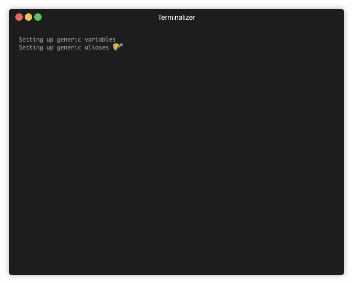

# Tail with pattern matching and filtering

This is a utility for tailing a text file similar to tail -f but with a few extra features:

* Coloring lines that match substring of regular expression
* Filtering out lines that does not match any of the configured patterns



## Get started

Perform
```
npm install taila -g
```

## Basic usage

Usage: taila [options] [filename]

Options:
  -V, --version  output the version number
  -a, --all      Read file form the beginning
  -l, --filter   Filter mode, do not display rows that does not match any pattern
  -h, --help     output usage information

```
   taila server.log
   taila -a server.log
```

During tailing it is possible to affect the operation of the tail process by pressing some command keys on the keyboard.

Commands during tailing:

* h - displays a list of commands
* i - displays a list of commands
* l - toggles the filering of that does not match any pattern
* b - (bump) inserts some new lines in the display
* r - reloads the file and starts tailing from the start. This is sometimes usefull when changing the filtering mode.


## Configuration

For the command to work properly it needs to have a list of patterns to search for. These patterns are configured in a file named .tailor.conf.js.
The command first looks for the ocnfig file in the current working directory. If that fails it looks in the users home folder for the file.

The file looks like this: 
```javascript
module.exports = {
  highlights: [
    {
      pattern: "[ERROR]",
      re: false,
      bkg: "bgRed",
      color: "black"
    },
    {
      pattern: "DEBUG",
      color: "green"
    },
    {
      pattern: "INFO",
      color: "blue",
    }
  ]
};

```

The pattern is either a substring or a regular expression. The property re is a flag indikating oid the pattern string ia regular expression or substring.

The colors have the following possible values:

### Colors

- `black`
- `red`
- `green`
- `yellow`
- `blue` *(On Windows the bright version is used since normal blue is illegible)*
- `magenta`
- `cyan`
- `white`
- `gray` ("bright black")
- `redBright`
- `greenBright`
- `yellowBright`
- `blueBright`
- `magentaBright`
- `cyanBright`
- `whiteBright`

### Background colors

- `bgBlack`
- `bgRed`
- `bgGreen`
- `bgYellow`
- `bgBlue`
- `bgMagenta`
- `bgCyan`
- `bgWhite`
- `bgBlackBright`
- `bgRedBright`
- `bgGreenBright`
- `bgYellowBright`
- `bgBlueBright`
- `bgMagentaBright`
- `bgCyanBright`
- `bgWhiteBright`
